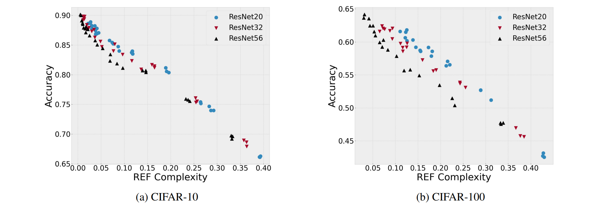

# Code for paper "Finding Generalization Measures by Contrasting Signal and Noise"

This project contains the code implementation of our paper submitted to ICML 2023, where we propose a new 
algorithm for generalization measurement and demonstrate its effectiveness on multiple datasets.

## Installation
We recommand use conda environment.
```
conda env create -f environment.yml
```

## Results

Correlation between REF complexity and test accuracy. 
We conduct over one hundred experiments with ResNet20, ResNet32, and RseNet56 on CIFAR-10 and CIFAR-100, showing that REF complexity negatively relates to test accuracy with correlations of -0.988 and -0.960 on CIFAR-10 and CIFAR-100, respectively. 
Please refer to our paper for more results.

## Usage
Run our REF algorithm with the following command. You may change the following arguments (e.g., model, epoch, decay, etc.)
by yourself.
```
python main.py --dataset CIFAR100 --aug --model 'resnet(32,1)' --metric loss --epochs 150 --decay 150 -b 256 --lr 0.01 --wd 1e-5 --seed 2023 --gpu 0 --visualize --repeat 5 
```

## Code References
Part of the code are from [robust-generalization-measures](https://github.com/nitarshan/robust-generalization-measures).

## Acknowledgments
Thank you for reading. If you have any questions or suggestions about our work, feel free to contact us.

## Paper Link
Camera ready, coming soon.

[Finding Generalization Measures by Contrasting Signal and Noise](Paper Link)
